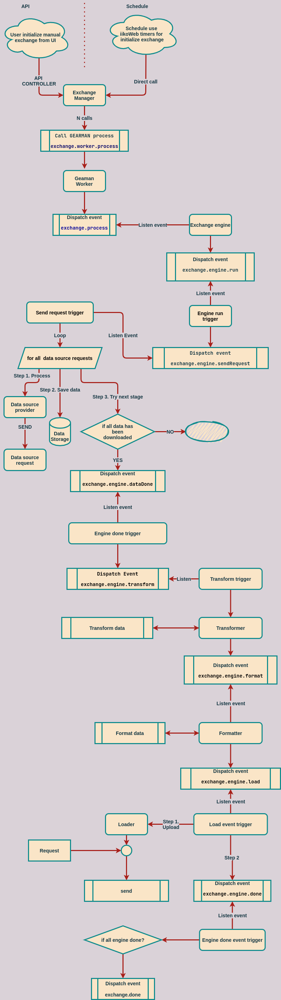

[](https://travis-ci.org/xeops/iiko-exchange)
[](https://packagist.org/packages/xeops/iiko-exchange)
[](https://packagist.org/packages/xeops/iiko-exchange)
[](https://packagist.org/packages/xeops/iiko-exchange)
[](//packagist.org/packages/xeops/iiko-exchange)

## iiko data exchange library
Данная библиотека предназначена для реализации бандлов по обмену данными между
сторонней системой и iiko или наоборот.

        /-------------/         /----------------/
       /    iiko     / ----->  / 3d paty system /
      /-------------/         /----------------/

## Installation
```shell
composer require xeops/iiko-exchange
```

## Exchange
Обьект Exchange состоит из:
* Engine
* Extractor
* Loader
* Schedule

### Engine
Engine - набор действий для формирования 1 цикла выгрузки:
* загрузить данные
* трансформировать - перевести поля и данные из формата источника в формат получателя
* форматировать - записать трансформированные данные в формат, установленный получаетелем ( json, csv, etc.)

### Extractor & Loader (Provider) 
Extractor,Loader или же Provider - класс для соединения c внешней системой или iiko,
служит для отправки запроса (Request).

### Schedule
Schedule - класс для расписания. Основные виды расписаний
* Крон
* Крон с периодом

### How it works?



### Create Exchange

```yaml
my_exchange:
    class: MyBundle\Exchange\MyExchange
    arguments: [ "EXCHANGE_CODE", "@event_dispatcher" ]
    tags:
        - { name: "exchange" }
    calls:
        - [ setEngines, [ [ "@my_exchange_engine_1" ] ] ]
        - [ setExtractor, [ "@exchange.provider.iiko.olap" ] ]
        - [ setLoader, [ "@my_exchange.provider" ] ]
        - [ setSchedules, [ [ "@exchange.schedule.cron" ] ] ]
```

