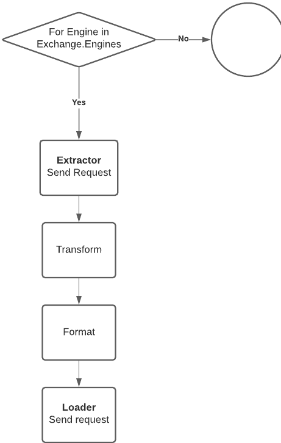

## Engines (Движки)

Движок - понятие внутри системы iikoWeb, обозначающее одно законченное действие на конкретном этапе процесса. Движки могут быть взаимозаменяемы или последовательны, в зависимости от архитектуры
приложения.

### Проблематика

При выполнении обмена между внешней системой и iiko возможны бизнес сценарии, когда за 1 итерацию при одних и тех же параметрах подключения и сопоставления необходимо выгрузить несколько файлов или
отправить во внешнюю систему несколько отчетов. В данном случае ломается система
`выгрузить данные -> преобразовать -> загрузить данные`, так как данное действие необходимо выполнять несколько раз.

Для этого есть механизм группировки действий (движок).

###  Пример конфигурирования
```yaml
# Пример объявления сервиса
exchange.acme.engine:
    class: iikoExchangeBundle\Engine\ExchangeEngine
    arguments: [ 'ENGINE_CODE' ]
    calls:
        - [ setRequests, [ [ '@exchange.acme.request.sales' ] ] ]
        - [ setFormatter, [ '@exchange.acme.formatter.sales' ] ]
        - [ setTransformer, [ '@exchange.acme.transformer' ] ]
```

В движок подключаются

- запросы
- форматер
- трансформер

_Подробнее про каждый подключаемый модуль можно найти на главной странице документации._

При такой архитектуре, появляется возможность выгрузить N файлов, например, и попросить пользователя только 1 раз заполнить данные для подключения, [сопоставления](Mapping.md) и другие
общие [настройки](./Configuration.md).

Так же [настройки](./Configuration.md) могут быть и уникальными для каждого движка.

### Пример работы

Как конкретно работает механизм обмена и как взаимодействуют движки на примере кода можно
посмотреть в [ExchangeManager::runExchange](./../src/Service/ExchangeManager.php)

